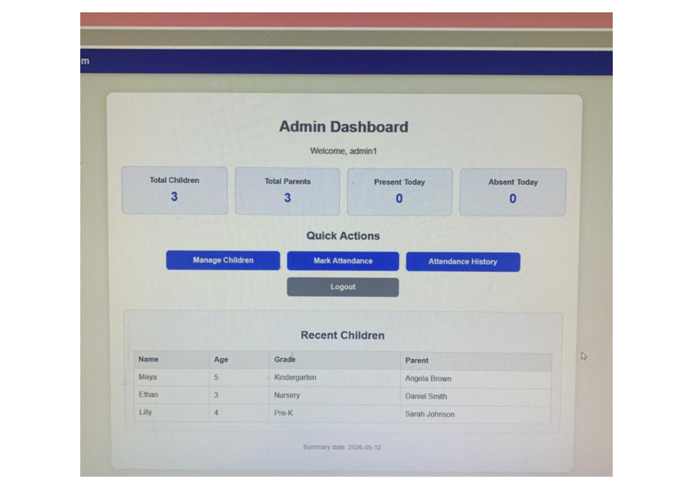
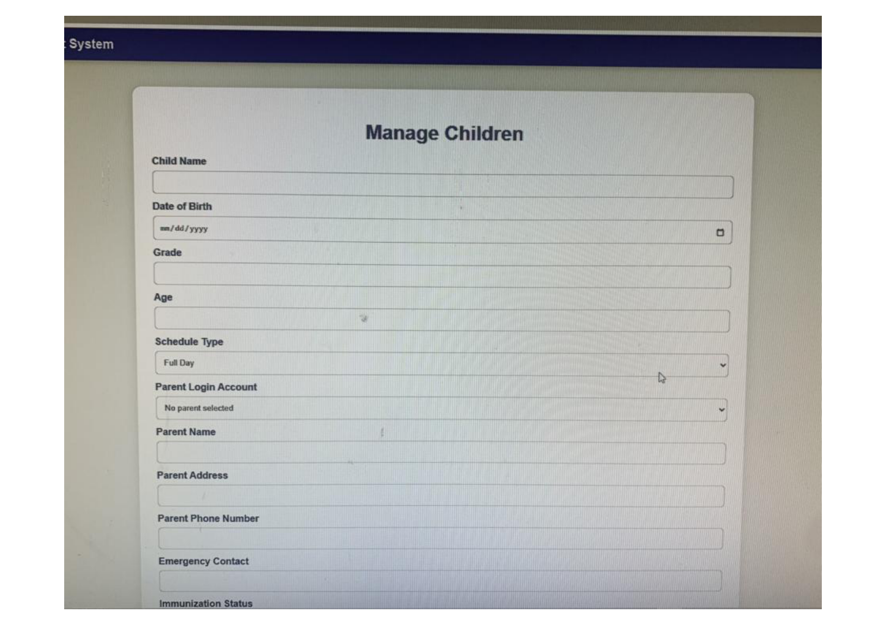
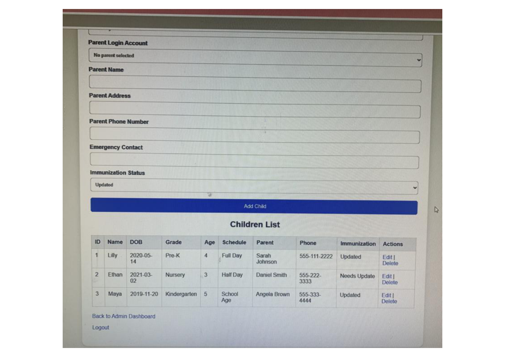
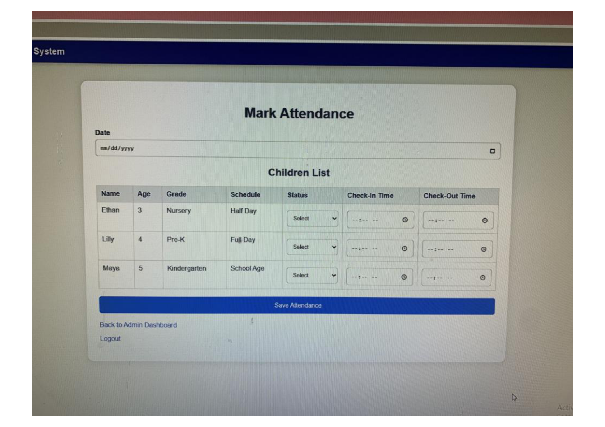
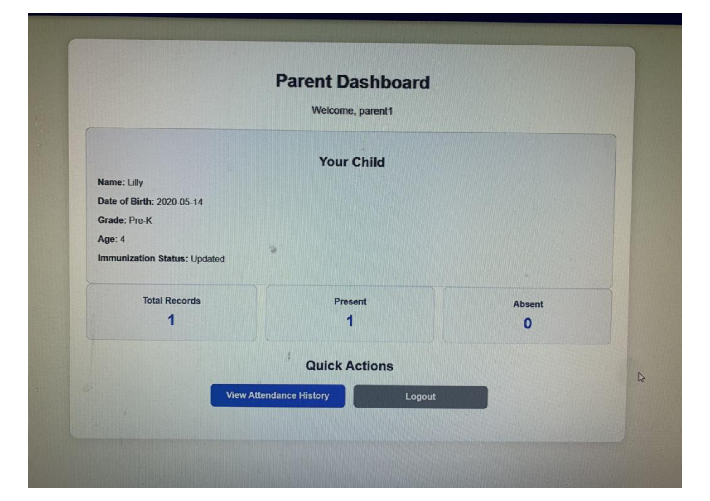

# Daycare Attendance Management System

A browser-based daycare management application built with Python, Flask, SQLite, HTML, CSS, and AWS Elastic Beanstalk. The system allows daycare staff to manage child records, track attendance, view attendance history, and organize parent, emergency contact, immunization, and schedule information.

## Project Overview

This project was created as a Software Engineering class project and designed to solve a real-world daycare record management problem. The application uses role-based access so administrators, employees, and parents can view different information based on their responsibilities.

## Live Demo

The application is deployed on AWS Elastic Beanstalk:

http://daycare-single-env.eba-h6f3p4du.us-east-1.elasticbeanstalk.com

## Features

- Role-based login for administrators, employees, and parents
- Password hashing for improved account security
- Admin dashboard for managing daycare records
- Employee dashboard for attendance-related tasks
- Parent dashboard for viewing child information
- Child profile management
- Attendance tracking with date, check-in time, and check-out time
- Attendance history for children and staff
- Parent and emergency contact information
- Immunization status tracking
- Schedule type tracking
- SQLite database with automatic database initialization
- AWS Elastic Beanstalk deployment

## Technologies Used

- Python
- Flask
- SQLite
- HTML
- CSS
- AWS Elastic Beanstalk
- Gunicorn
- Git and GitHub

## Screenshots

### Login Page


### Admin Dashboard


### Manage Children Form


### Manage Children List


### Mark Attendance


### Parent Dashboard


## User Roles

### Administrator

Administrators can manage child records, view attendance history, and access daycare management features.

### Employee

Employees can mark attendance, view assigned attendance information, and access staff-related dashboard features.

### Parent

Parents can view information related to their child, including attendance records and daycare profile information.

## How to Run Locally

1. Clone the repository or download the project folder.
2. Open the project folder in VS Code or another code editor.
3. Create and activate a virtual environment.
4. Install the project dependencies.
5. Run the database setup file.
6. Start the Flask application.

```bash
py -m venv venv
.\venv\Scripts\Activate.ps1
pip install -r requirements.txt
python init_db.py
python app.py
```

Then open the application in your browser:

```text
http://127.0.0.1:5000
```

## Demo Accounts

| Role | Username | Password |
|---|---|---|
| Admin | admin1 | admin123 |
| Employee | teacher1 | teach123 |
| Parent 1 | parent1 | parent123 |
| Parent 2 | parent2 | parent234 |
| Parent 3 | parent3 | parent345 |

## Project Structure

```text
daycare_project/
│
├── app.py
├── init_db.py
├── requirements.txt
├── Procfile
├── README.md
├── .gitignore
│
├── screenshots/
│   ├── login.png
│   ├── admin-dashboard.png
│   ├── manage-children-form.png
│   ├── manage-children-list.png
│   ├── mark-attendance.png
│   └── parent-dashboard.png
│
├── static/
│   └── style.css
│
└── templates/
    ├── admin_dashboard.html
    ├── admin_history.html
    ├── attendance_history.html
    ├── edit_child.html
    ├── login.html
    ├── manage_children.html
    ├── mark_attendance.html
    ├── parent_dashboard.html
    ├── staff_history.html
    ├── teacher_dashboard.html
    └── teacher_history.html
```

## Database Setup

The `daycare.db` file is not included in the repository because it is generated locally. To create or reset the database, run:

```bash
python init_db.py
```

The application also includes automatic database initialization, allowing the database to be created when the app starts if the database file does not already exist.

## Deployment

The application is deployed using AWS Elastic Beanstalk with a Python platform environment. A `Procfile` is included so the application can be started with Gunicorn during deployment.

```text
web: gunicorn app:app
```

## Security Note

This project is currently designed for learning, demonstration, and portfolio purposes. Passwords are hashed, and the Flask secret key can be configured through an environment variable. Future production improvements would include stronger authentication, HTTPS with a custom domain, environment-based configuration, and a production database such as PostgreSQL or Amazon RDS.

## Future Improvements

- Add PostgreSQL or Amazon RDS support for production deployment
- Add a custom domain and HTTPS configuration
- Improve the user interface for mobile devices
- Add admin reporting features
- Add downloadable forms for parent and immunization records
- Add parent document upload functionality
- Add automated tests for important routes and database actions
- Add CI/CD deployment workflow with GitHub Actions

## Author

Antonio Collier  
Management Information Systems Student  
GitHub: github.com/antoniocollier